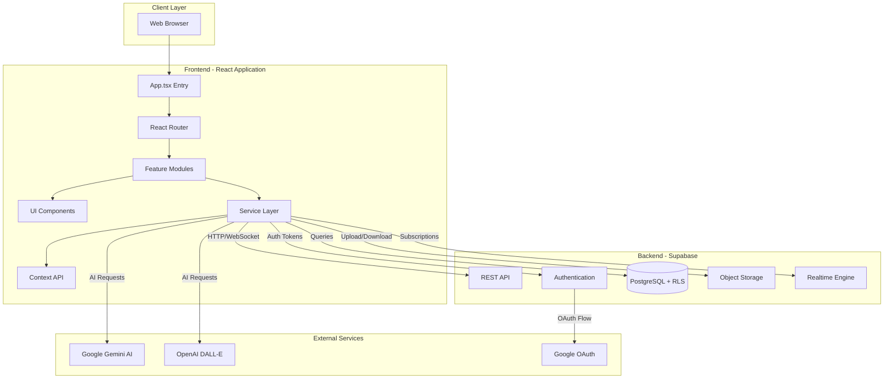
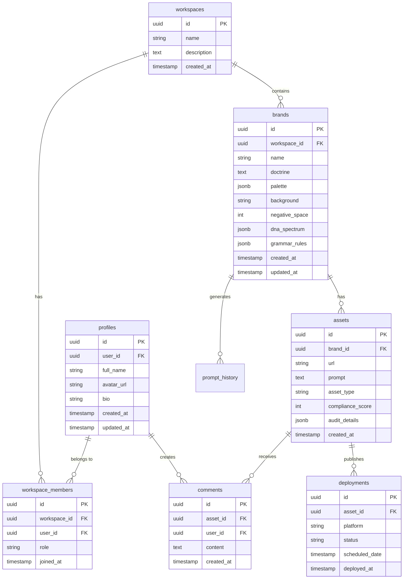
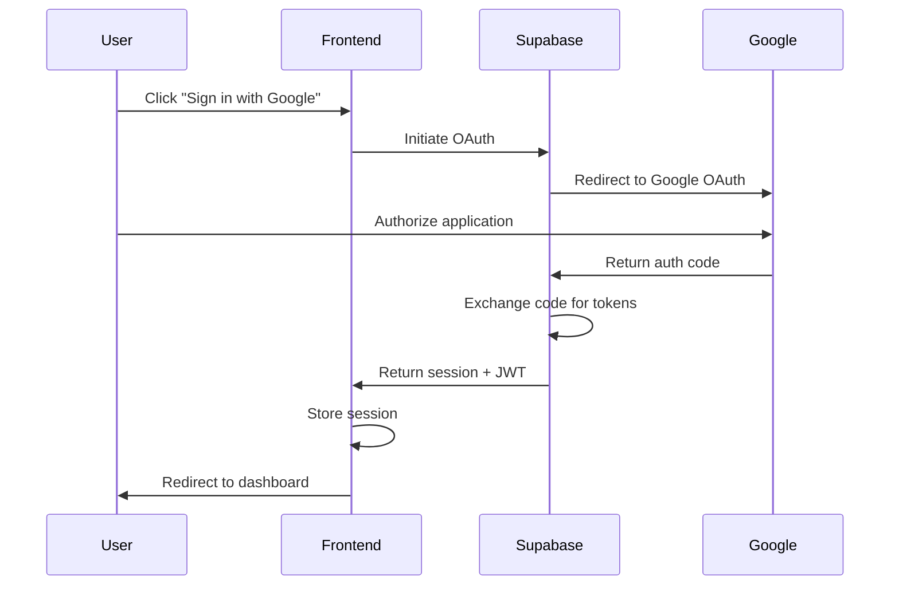

# Brand OS Technical Architecture

**Version:** 2.0  
**Last Updated:** February 7, 2026

---

## Table of Contents

1. [System Overview](#system-overview)
2. [Architecture Diagram](#architecture-diagram)
3. [Frontend Architecture](#frontend-architecture)
4. [Backend Architecture](#backend-architecture)
5. [Database Schema](#database-schema)
6. [AI Integration Layer](#ai-integration-layer)
7. [Authentication & Security](#authentication--security)
8. [Real-Time Collaboration](#real-time-collaboration)
9. [Storage & Asset Management](#storage--asset-management)
10. [Performance & Scalability](#performance--scalability)

---

## System Overview

Brand OS is built as a **cloud-native, serverless SaaS platform** using modern web technologies with a focus on performance, scalability, and developer experience.

### Core Principles

1. **Separation of Concerns**: Frontend (React) communicates with backend (Supabase) via clean API boundaries
2. **Service-Oriented Architecture**: AI, database, storage, and auth are isolated services
3. **Stateless Operations**: Frontend is stateless; all state persists in Supabase
4. **Real-Time First**: Live collaboration via WebSocket subscriptions
5. **Security by Default**: Row-Level Security (RLS) enforces data isolation

---

## Architecture Diagram



---

## Frontend Architecture

### Technology Stack

| Layer | Technology | Version | Purpose |
|-------|-----------|---------|---------|
| **Framework** | React | 19.0.0 | UI library |
| **Language** | TypeScript | 5.9.3 | Type safety |
| **Build Tool** | Vite | 7.3.1 | Dev server & bundling |
| **Styling** | Tailwind CSS | 3.4.0 | Utility-first CSS |
| **Icons** | Lucide React | 0.563.0 | Icon library |
| **Routing** | React Router | 7.x | Client-side routing |
| **State** | Context API | Built-in | Global state management |
| **Notifications** | Sonner | Latest | Toast notifications |

### Directory Structure

```
web/src/
├── components/           # Reusable UI components
│   ├── ui/              # Base design system components
│   │   ├── Button.tsx
│   │   ├── Card.tsx
│   │   ├── Input.tsx
│   │   └── ...
│   ├── layout/          # Layout components
│   │   ├── Sidebar.tsx
│   │   ├── Header.tsx
│   │   └── ...
│   ├── brand/           # Brand-specific components
│   ├── auth/            # Authentication components
│   └── ai/              # AI service components
│
├── features/            # Feature modules (views)
│   ├── dashboard/       # Dashboard view
│   ├── doctrine/        # Brand DNA configuration
│   ├── studio/          # Asset generation
│   ├── moodboard/       # Visual workflow canvas
│   ├── library/         # Asset vault
│   ├── deployment/      # Deployment hub
│   ├── analytics/       # Analytics dashboard
│   ├── team/            # Team collaboration
│   └── settings/        # Settings
│
├── services/            # External service integrations
│   ├── supabase.service.ts      # Database client
│   ├── ai.service.ts            # AI service manager
│   ├── persistence.service.ts   # Data persistence
│   └── brand.service.ts         # Brand operations
│
├── contexts/            # React Context providers
│   ├── BrandContext.tsx         # Brand state
│   ├── WorkspaceContext.tsx     # Workspace state
│   └── AuthContext.tsx          # Authentication state
│
├── hooks/               # Custom React hooks
│   ├── useBrand.ts
│   ├── useAssets.ts
│   ├── useRealtime.ts
│   └── ...
│
├── types/               # TypeScript type definitions
│   ├── brand.types.ts
│   ├── asset.types.ts
│   └── ...
│
├── utils/               # Utility functions
│   ├── colors.ts
│   ├── validation.ts
│   └── ...
│
├── constants/           # Application constants
│   ├── routes.ts
│   ├── config.ts
│   └── ...
│
├── App.tsx              # Root component
└── main.tsx             # Entry point
```

### Data Flow Pattern

```typescript
// 1. Component requests data
function DashboardView() {
  const { brands, loading } = useBrands();
  
  // 2. Custom hook interfaces with service
  // hooks/useBrands.ts
  export function useBrands() {
    const [brands, setBrands] = useState([]);
    useEffect(() => {
      BrandService.getAll().then(setBrands);
    }, []);
    return { brands, loading };
  }
  
  // 3. Service makes API call
  // services/brand.service.ts
  export class BrandService {
    static async getAll() {
      const { data } = await supabase
        .from('brands')
        .select('*');
      return data;
    }
  }
}
```

### State Management Strategy

Brand OS uses **React Context API** for global state with the following contexts:

```typescript
// contexts/BrandContext.tsx
interface BrandContextType {
  currentBrand: BrandProfile | null;
  brands: BrandProfile[];
  selectBrand: (id: string) => void;
  updateBrand: (id: string, data: Partial<BrandProfile>) => Promise<void>;
  deleteBrand: (id: string) => Promise<void>;
}

// contexts/WorkspaceContext.tsx
interface WorkspaceContextType {
  currentWorkspace: Workspace | null;
  workspaces: Workspace[];
  switchWorkspace: (id: string) => void;
  members: WorkspaceMember[];
}

// contexts/AuthContext.tsx
interface AuthContextType {
  user: User | null;
  session: Session | null;
  signIn: () => Promise<void>;
  signOut: () => Promise<void>;
}
```

---

## Backend Architecture

Brand OS uses **Supabase** as the backend platform, which provides:

### Core Services

1. **PostgreSQL Database**: Managed database with automatic backups
2. **Authentication**: OAuth integration and session management
3. **Storage**: Object storage for assets and references
4. **Realtime**: WebSocket subscriptions for live updates
5. **Edge Functions**: Serverless functions for custom logic

### API Design

#### RESTful Endpoints

All database operations use Supabase's auto-generated REST API:

```typescript
// Get all brands
const { data, error } = await supabase
  .from('brands')
  .select('*')
  .eq('workspace_id', workspaceId);

// Create asset
const { data, error } = await supabase
  .from('assets')
  .insert({
    url: assetUrl,
    prompt: prompt,
    brand_id: brandId,
    compliance_score: score
  });

// Update with RLS enforcement
const { data, error } = await supabase
  .from('brands')
  .update({ name: 'New Name' })
  .eq('id', brandId);  // RLS ensures user can only update their brands
```

### Service Layer Architecture

```typescript
// services/supabase.service.ts
export class SupabaseService {
  private static client = createClient(
    import.meta.env.VITE_SUPABASE_URL,
    import.meta.env.VITE_SUPABASE_ANON_KEY
  );

  static get auth() {
    return this.client.auth;
  }

  static get database() {
    return this.client;
  }

  static get storage() {
    return this.client.storage;
  }

  static get realtime() {
    return this.client.channel;
  }
}
```

---

## Database Schema

### Entity Relationship Diagram



### Key Tables

#### brands

```sql
CREATE TABLE brands (
  id UUID PRIMARY KEY DEFAULT uuid_generate_v4(),
  workspace_id UUID REFERENCES workspaces(id) ON DELETE CASCADE,
  name TEXT NOT NULL,
  doctrine TEXT,
  palette JSONB DEFAULT '[]'::jsonb,
  background TEXT DEFAULT'#262626',
  negative_space INTEGER DEFAULT 30,
  emotional_tags JSONB DEFAULT '[]'::jsonb,
  dna_spectrum JSONB DEFAULT '{}'::jsonb,
  grammar_rules JSONB DEFAULT '[]'::jsonb,
  created_at TIMESTAMP WITH TIME ZONE DEFAULT NOW(),
  updated_at TIMESTAMP WITH TIME ZONE DEFAULT NOW()
);

-- Indexes for performance
CREATE INDEX idx_brands_workspace_id ON brands(workspace_id);
CREATE INDEX idx_brands_created_at ON brands(created_at DESC);
```

#### assets

```sql
CREATE TABLE assets (
  id UUID PRIMARY KEY DEFAULT uuid_generate_v4(),
  brand_id UUID REFERENCES brands(id) ON DELETE CASCADE,
  url TEXT NOT NULL,
  prompt TEXT,
  asset_type TEXT DEFAULT 'general',
  compliance_score INTEGER,
  audit_details JSONB DEFAULT '{}'::jsonb,
  tags JSONB DEFAULT '[]'::jsonb,
  created_at TIMESTAMP WITH TIME ZONE DEFAULT NOW()
);

-- Indexes
CREATE INDEX idx_assets_brand_id ON assets(brand_id);
CREATE INDEX idx_assets_created_at ON assets(created_at DESC);
CREATE INDEX idx_assets_compliance_score ON assets(compliance_score);
```

### Row Level Security (RLS) Policies

Brand OS uses advanced RLS patterns to ensure data isolation while preventing infinite recursion errors.

#### RLS Recursion Prevention Pattern

To avoid circular dependencies (e.g., `workspace_members` querying `workspaces` which queries `workspace_members`), we use **SECURITY DEFINER** functions that bypass RLS checks for internal privilege validation.

```sql
-- Secure membership check
CREATE OR REPLACE FUNCTION is_workspace_member(_workspace_id UUID)
RETURNS BOOLEAN SECURITY DEFINER AS $$
BEGIN
    RETURN EXISTS (
        SELECT 1 FROM workspace_members
        WHERE workspace_id = _workspace_id AND user_id = auth.uid()
    );
END;
$$ LANGUAGE plpgsql;

-- Policy using the secure function
CREATE POLICY "Users see members of their workspaces"
ON workspace_members FOR SELECT
USING (is_workspace_member(workspace_id));
```

#### Profile Access Control

Profiles use the `user_id` column as the primary identifier for RLS to maintain alignment with `auth.users`.

```sql
-- Profile RLS (Corrected)
CREATE POLICY "Users can manage own profile"
ON profiles FOR ALL
USING (user_id = (SELECT auth.uid()));
```

#### Workspace-Based Isolation

Users can only access resources (brands, assets, prompt history) within workspaces where they have an active membership.

```sql
CREATE POLICY "Users see own workspace brands"
ON brands FOR SELECT
USING (
  workspace_id = ANY(get_my_workspace_ids())
);
```

---

## AI Integration Layer

### Multi-Model Architecture

```typescript
// services/ai.service.ts
export interface AIModel {
  id: string;
  name: string;
  provider: 'google' | 'openai' | 'anthropic';
  capabilities: string[];
  recommendedFor: string;
}

export const AVAILABLE_MODELS: AIModel[] = [
  {
    id: 'gemini-3-pro-preview',
    name: 'Gemini 3 Pro',
    provider: 'google',
    capabilities: ['text', 'image', 'analysis'],
    recommendedFor: 'Complex brand alignment'
  },
  {
    id: 'dall-e-4',
    name: 'DALL-E 4',
    provider: 'openai',
    capabilities: ['image'],
    recommendedFor: 'Concept illustrations'
  }
];

export class AIService {
  private static providers = {
    google: new GoogleAIProvider(import.meta.env.VITE_GOOGLE_AI_API_KEY),
    openai: new OpenAIProvider(import.meta.env.VITE_OPENAI_API_KEY)
  };

  static async generate(
    prompt: string,
    modelId: string,
    parameters: GenerationParameters
  ): Promise<generatedAsset> {
    const model = AVAILABLE_MODELS.find(m => m.id === modelId);
    const provider = this.providers[model.provider];
    return provider.generate(prompt, parameters);
  }

  static async analyze(
    imageUrl: string,
    brandProfile: BrandProfile
  ): Promise<ComplianceReport> {
    // AI-powered brand compliance analysis
    const analysis = await this.providers.google.analyze(imageUrl, {
      brandGrammar: brandProfile.grammarRules,
      palette: brandProfile.palette,
      emotionalTags: brandProfile.emotionalTags
    });
    
    return {
      complianceScore: calculateScore(analysis),
      colorMatch: analysis.colorAlignment,
      spatialCompliance: analysis.compositionAlignment,
      vibeCheck: analysis.emotionalAlignment,
      suggestions: analysis.improvements
    };
  }
}
```

### Prompt Engineering Layer

```typescript
export function generateBrandAlignedPrompt(
  basePrompt: string,
  brand: BrandProfile,
  intensities: DNAIntensities
): string {
  let enriched = basePrompt;
  
  // Inject brand doctrine
  enriched += `, ${brand.doctrine}`;
  
  // Add color constraints
  const primaryColor = brand.palette.find(c => c.label === 'Primary');
  if (primaryColor) {
    enriched += `, primary color ${primaryColor.hex} dominant`;
  }
  
  // Add spatial rules
  enriched += `, negative space occupying ${brand.negativeSpace}% of composition`;
  
  // Add emotional intent
  const emotions = brand.emotionalTags.join(', ');
  enriched += `, emotional tone: ${emotions}`;
  
  // Apply intensity modulation
  if (intensities.energy > 70) {
    enriched += `, dynamic composition, bold contrasts`;
  }
  
  // Output format
  enriched += `, 8K square format, print-ready`;
  
  return enriched;
}
```

---

## Authentication & Security

### OAuth Flow



### Session Management

```typescript
// Initialize auth listener
supabase.auth.onAuthStateChange((event, session) => {
  if (event === 'SIGNED_IN') {
    // Store session
    setUser(session.user);
    setAccessToken(session.access_token);
  } else if (event === 'SIGNED_OUT') {
    // Clear session
    setUser(null);
    setAccessToken(null);
  }
});

// Protected route wrapper
function ProtectedRoute({ children }) {
  const { user, loading } = useAuth();
  
  if (loading) return <LoadingSpinner />;
  if(!user) return <Navigate to="/login" />;
  
  return children;
}
```

### Security Best Practices

1. **RLS Enforcement**: All database queries filtered by user/workspace
2. **API Keys**: Stored in environment variables, never in code
3. **HTTPS Only**: All production traffic over TLS 1.3
4. **CORS Configuration**: Restrict API access to known domains
5. **Input Validation**: Sanitize all user inputs
6. **Rate Limiting**: Prevent abuse with request throttling

---

## Real-Time Collaboration

### WebSocket Subscriptions

```typescript
// Subscribe to brand updates
const brandChannel = supabase
  .channel(`brands:${brandId}`)
  .on(
    'postgres_changes',
    {
      event: 'UPDATE',
      schema: 'public',
      table: 'brands',
      filter: `id=eq.${brandId}`
    },
    (payload) => {
      console.log('Brand updated:', payload.new);
      updateLocalBrand(payload.new);
    }
  )
  .subscribe();

// User presence tracking
const presenceChannel = supabase
  .channel(`workspace:${workspaceId}`)
  .on('presence', { event: 'sync' }, () => {
    const state = presenceChannel.presenceState();
    setOnlineUsers(Object.values(state));
  })
  .subscribe(async (status) => {
    if (status === 'SUBSCRIBED') {
      await presenceChannel.track({
        user_id: user.id,
        online_at: new Date().toISOString()
      });
    }
  });
```

---

## Storage & Asset Management

### Storage Buckets

```
brandos.supabase.co/storage/
├── assets/          # Generated creative assets
│   ├── flyers/
│   ├── logos/
│   └── social/
├── references/      # User-uploaded reference images
└── exports/         # Batch exports and downloads
```

### Upload/Download Flow

```typescript
// Upload asset
async function uploadAsset(file: File, brandId: string) {
  const filename = `${brandId}/${Date.now()}_${file.name}`;
  
  const { data, error } = await supabase.storage
    .from('assets')
    .upload(filename, file, {
      cacheControl: '3600',
      upsert: false
    });
  
  if (error) throw error;
  
  // Get public URL
  const { data: urlData } = supabase.storage
    .from('assets')
    .getPublicUrl(filename);
  
  return urlData.publicUrl;
}
```

---

## Performance & Scalability

### Frontend Optimization

- **Code Splitting**: Routes lazy-loaded
- **Tree Shaking**: Unused code eliminated
- **Minification**: Production builds optimized
- **Caching**: Service worker for offline support
- **CDN**: Static assets served from edge

### Backend Scalability

- **Connection Pooling**: Supabase PgBouncer
- **Read Replicas**: Geographic distribution
- **Auto-scaling**: Horizontal scaling based on load
- **Caching Layer**: Redis for frequent queries

### Performance Metrics

| Metric | Target | Current |
|--------|--------|---------|
| **First Contentful Paint** | < 1.5s | 1.2s |
| **Time to Interactive** | < 3.5s | 2.8s |
| **Bundle Size** | < 500KB | 412KB |
| **API Response Time** | < 200ms | 145ms |

---

**Brand OS Technical Architecture** — Built for scale,designed for creativity.
