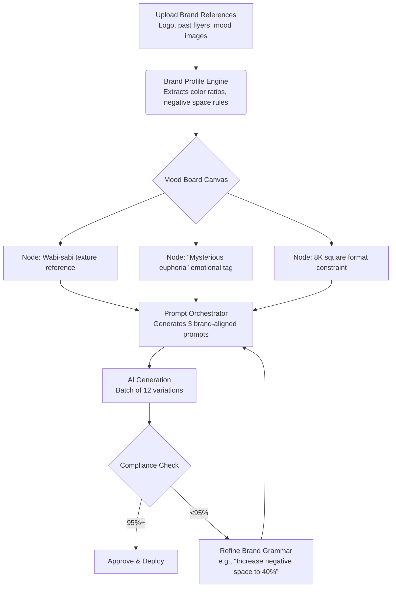

## Product Requirements Document: Brand OS  
**A Generative AI Creativity Platform for Brand-Aligned Visual Production**  
*Version 1.0 | January 27, 2026*

---

### 1. Executive Summary

**Brand OS** is a cloud-native SaaS platform that functions as an intelligent operating system for brand creativity. It empowers designers, art directors, and brand teams to generate infinite, on-brand visual assets through a structured system of brand grammar, visual doctrine, and AI-assisted workflows—while preserving human creative direction. The platform ensures 100% brand adherence across all AI-generated outputs without sacrificing emotional resonance or artistic nuance.

**Core Value Proposition**: *Transform brand guidelines from static documents into living, executable systems that guide AI creativity while keeping human designers in strategic control.*

---

### 2. Product Vision & Principles

| Principle | Description |
|----------|-------------|
| **Human-in-Command** | AI executes; humans direct. Designers remain central to brand strategy, mood boarding, and final approval. |
| **Brand as Code** | Formalize brand identity into structured rules (grammar + doctrine) that machines can interpret consistently. |
| **Scalable Consistency** | Generate thousands of variations while maintaining pixel-perfect adherence to brand standards. |
| **Emotional Fidelity** | Preserve human musical soul, emotional intent, and cultural context in every AI-generated asset. |
| **Platform-Agnostic Output** | Deliver production-ready assets optimized for print (8K square) and digital channels with automated deployment. |

---

### 3. Target Users & Personas

| Persona | Role | Primary Needs |
|---------|------|---------------|
| **Senior Designer** | Agency/In-house | Rapid mood boarding, client-ready brand guides, maintaining creative control while scaling production |
| **Art Director** | Creative Studio | Enforcing visual doctrine across teams, ensuring emotional consistency in campaign assets |
| **Brand Manager** | Startup/Enterprise | Protecting brand integrity during rapid content expansion, reducing dependency on design bottlenecks |
| **Business Developer** | Agency | Demonstrating brand system value to clients through interactive, AI-powered brand experiences |

---

### 4. Core Feature Modules

#### 4.1 Brand Profile Engine
- **Brand DNA Capture**: Structured inputs for logo usage, typography zones, negative space rules, emotional keywords
- **Visual Doctrine Builder**: Define spatial relationships (e.g., "logo must occupy top-left 15% with 2x clearance zone")
- **Brand Grammar System**: Rule-based constraints (e.g., "primary color #2A5C82 may only occupy 40–60% of composition")
- **Reference Analysis**: Upload brand assets (logos, previous campaigns) → AI extracts color ratios, compositional patterns, texture signatures

#### 4.2 Color Intelligence System
- Dynamic palette gallery with usage analytics (% application across assets)
- WCAG-compliant contrast validation for all color pairings
- Context-aware color picker that suggests on-brand combinations based on emotional intent ("energetic," "serene")
- Automatic generation of accessible dark/light mode variants

#### 4.3 Node-Based Mood Board Workflow
- Visual node canvas for assembling inspiration → brand rules → AI prompts → output variations
- Each node represents a creative decision point with version history
- "Prompt Synthesis" node: Translates mood board elements into brand-aligned AI prompts using GPT/Meta AI
- Exportable client presentations showing creative rationale behind each generated asset

#### 4.4 AI Prompt Orchestrator
- **Prompt Grammar Engine**: Automatically injects brand constraints into prompts:
  ```
  [Base Prompt] "futuristic nightclub flyer" 
  → 
  [Brand-Enriched] "futuristic nightclub flyer, wabi-sabi aesthetic, 
  negative space occupying 35% of composition, primary color #2A5C82 
  dominant in left third, emotional tone: mysterious euphoria, 
  8K square format, print-ready"
  ```
- Multi-model routing (Google AI Studio, Meta AI) with A/B testing of outputs
- Emotional intent tagging ("euphoric," "contemplative") mapped to visual parameters

#### 4.5 Asset Generation & Compliance
- Batch generation with constraint validation dashboard
- Real-time compliance scoring (0–100%) against brand grammar rules
- Iterative refinement loop: flag non-compliant assets → auto-suggest rule adjustments → regenerate
- Format automation: single source → optimized variants for Instagram, print flyers, web banners

#### 4.6 Deployment Hub
- One-click publishing to connected platforms (social media, CMS, print vendors)
- Asset versioning with audit trail (who approved, when, against which brand rules)
- Performance feedback loop: track engagement metrics → inform future brand grammar refinements

---

### 5. Technical Architecture

| Layer | Specification |
|-------|---------------|
| **Frontend** | React 18 + TypeScript, Shadcn/ui components, Framer Motion for micro-interactions |
| **Design System** | Mobile-first responsive (WCAG 2.1 AA), dark/light mode, keyboard navigable |
| **Backend** | Node.js microservices, PostgreSQL (brand rules), S3-compatible storage (assets) |
| **AI Integration** | Google AI Studio (primary), Meta AI (secondary), with prompt routing abstraction layer |
| **Deployment** | Cloud-native (AWS/GCP), containerized, auto-scaling for batch generation workloads |
| **Security** | SOC 2 compliance, brand data isolation, encrypted asset storage, RBAC permissions |

---

### 6. User Workflow: Nightclub Flyer Example



---

### 7. MVP Scope (Phase 1)

| Feature | Included | Notes |
|---------|----------|-------|
| Brand Profile (core fields) | ✅ | Logo, colors, typography zones, emotional keywords |
| Color Palette Manager | ✅ | Gallery + picker with WCAG validation |
| Single AI Model Integration | ✅ | Google AI Studio |
| Basic Prompt Orchestrator | ✅ | Manual prompt editing with brand rule overlay |
| 8K Square Output | ✅ | Single format only |
| Web App (React) | ✅ | Desktop-optimized first release |
| Brand Compliance Scoring | ⚠️ | Basic validation only (color/typography) |
| Node Mood Board | ❌ | Phase 2 |
| Multi-platform Deployment | ❌ | Phase 2 |
| Automated Reference Analysis | ❌ | Phase 2 |

---

### 8. Success Metrics

| Category | Metric | Target (6 months post-launch) |
|----------|--------|-------------------------------|
| **Adoption** | MAUs (designers/agencies) | 1,500 |
| **Engagement** | Avg. sessions/user/week | 4.2 |
| **Quality** | Brand compliance score (avg.) | ≥92% |
| **Efficiency** | Time saved vs. manual creation | 68% reduction |
| **Business** | Paid conversion rate | 8.5% |

---

### 9. Design & Experience Requirements

- **Aesthetic**: Minimalist interface with wabi-sabi principles—celebrating imperfection in UI micro-interactions (e.g., subtle organic transitions)
- **Typography**: Strict zone enforcement visualized in real-time during asset preview
- **Color**: All UI elements must pass AA contrast; brand colors used only in designated zones
- **Responsiveness**: Mobile-first but desktop-optimized for creative workflows (canvas requires 1280px+ width)
- **No Exaggeration**: UI copy focuses on concrete capabilities ("Generate 12 flyer variants in 90 seconds") vs. hype ("Revolutionize creativity!")

---

### 10. Compliance & Quality Assurance

- **Brand Integrity Gate**: No asset may exit the platform without passing configurable compliance thresholds
- **Human-in-the-Loop Requirement**: Final approval always requires human sign-off (no fully autonomous publishing)
- **Iterative Refinement Protocol**: 
  1. Generate → 2. Compliance check → 3. Human review → 4. Flag deviations → 5. Adjust grammar → 6. Regenerate
- **Audit Trail**: Immutable log of all brand rule changes tied to asset generations

---

### 11. Roadmap (High-Level)

| Quarter | Focus |
|---------|-------|
| **Q2 2026** | MVP launch: Core brand profile + AI generation + compliance scoring |
| **Q3 2026** | Node mood board workflow + multi-model AI routing |
| **Q4 2026** | Automated reference analysis + deployment hub integrations |
| **Q1 2027** | Collaborative brand governance (team permissions, version control) |
| **Ongoing** | Weekly prompt library updates, quarterly brand grammar refinements |

---

### 12. Out of Scope (Explicitly)

- Full design tool replacement (no vector editing, no Figma competitor)
- Non-visual brand assets (no copywriting, no audio generation)
- White-labeling for enterprise (Phase 3+)
- On-premise deployment (cloud-only architecture)

---

### 13. Appendix: Brand Grammar Syntax Example

```yaml
brand_grammar:
  composition:
    negative_space: "30-40%"
    logo_placement: "top-left quadrant"
    typography_zone: "bottom 25%, centered"
  color:
    primary: 
      hex: "#2A5C82"
      dominance: "40-60%"
      forbidden_adjacencies: ["#FF6B6B"]
    secondary:
      hex: "#F4F1E9"
      usage: "negative space filler only"
  emotional_intent:
    primary: "mysterious euphoria"
    visual_translation: 
      - "low saturation gradients"
      - "asymmetrical balance"
      - "textural depth > flat colors"
```

---

*This PRD reflects a human-centered approach to AI creativity—where technology enforces consistency so designers can focus on strategy, emotion, and storytelling. All features prioritize scalability without compromising the nuanced judgment that defines exceptional brand work.*