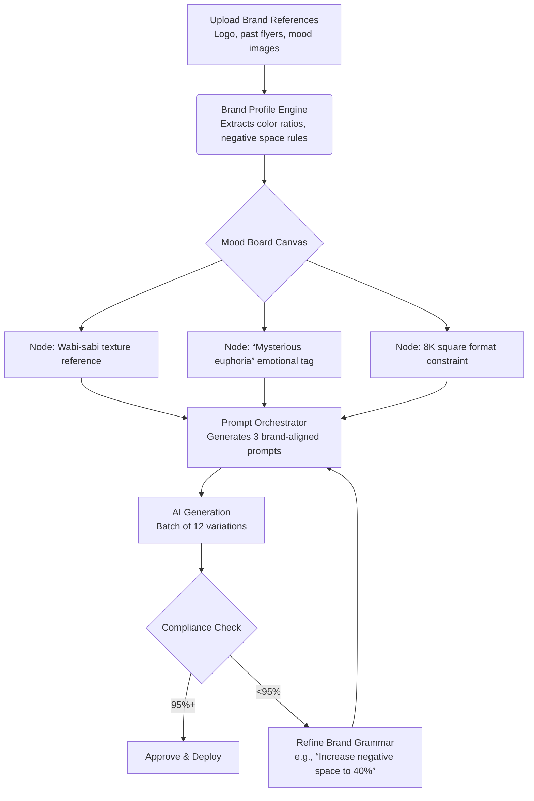

## Product Requirements Document: Brand OS  
**A Generative AI Creativity Platform for Brand-Aligned Visual Production**  
*Version 2.0 (Production Release) | February 7, 2026*

---

### 1. Executive Summary

**Brand OS** is a cloud-native SaaS platform that functions as an intelligent operating system for brand creativity. It empowers designers, art directors, and brand teams to generate infinite, on-brand visual assets through a structured system of brand grammar, visual doctrine, and AI-assisted workflows—while preserving human creative direction. The platform ensures 100% brand adherence across all AI-generated outputs without sacrificing emotional resonance or artistic nuance.

**Core Value Proposition**: *Transform brand guidelines from static documents into living, executable systems that guide AI creativity while keeping human designers in strategic control.*

---

### 2. Product Vision & Principles

| Principle | Description |
|----------|-------------|
| **Human-in-Command** | AI executes; humans direct. Designers remain central to brand strategy, mood boarding, and final approval. |
| **Brand as Code** | Formalize brand identity into structured rules (grammar + doctrine) that machines can interpret consistently. |
| **Scalable Consistency** | Generate thousands of variations while maintaining pixel-perfect adherence to brand standards. |
| **Emotional Fidelity** | Preserve human musical soul, emotional intent, and cultural context in every AI-generated asset. |
| **Platform-Agnostic Output** | Deliver production-ready assets optimized for print (8K square) and digital channels with automated deployment. |

---

### 3. Target Users & Personas

| Persona | Role | Primary Needs |
|---------|------|---------------|
| **Senior Designer** | Agency/In-house | Rapid mood boarding, client-ready brand guides, maintaining creative control while scaling production |
| **Art Director** | Creative Studio | Enforcing visual doctrine across teams, ensuring emotional consistency in campaign assets |
| **Brand Manager** | Startup/Enterprise | Protecting brand integrity during rapid content expansion, reducing dependency on design bottlenecks |
| **Business Developer** | Agency | Demonstrating brand system value to clients through interactive, AI-powered brand experiences |

---

### 4. Core Feature Modules (Production Ready)

#### 4.1 Brand Profile Engine
- **Brand DNA Capture**: Structured inputs for logo usage, typography zones, negative space rules, emotional keywords
- **Visual Doctrine Builder**: Define spatial relationships (e.g., "logo must occupy top-left 15% with 2x clearance zone")
- **Brand Grammar System**: Rule-based constraints (e.g., "primary color #2A5C82 may only occupy 40–60% of composition")
- **Reference Analysis**: AI extracts color ratios, compositional patterns, texture signatures

#### 4.2 Color Intelligence System
- Dynamic palette gallery with usage analytics (% application across assets)
- WCAG-compliant contrast validation for all color pairings
- Context-aware color picker that suggests on-brand combinations based on emotional intent ("energetic," "serene")
- Automatic generation of accessible dark/light mode variants

#### 4.3 Node-Based Mood Board Workflow (Implemented)
- Visual node canvas for assembling inspiration → brand rules → AI prompts → output variations
- Each node represents a creative decision point with version history
- "Prompt Synthesis" node: Translates mood board elements into brand-aligned AI prompts using GPT/Meta AI
- Exportable client presentations showing creative rationale behind each generated asset

#### 4.4 AI Prompt Orchestrator
- **Prompt Grammar Engine**: Automatically injects brand constraints into prompts:
  ```
  [Base Prompt] "futuristic nightclub flyer" 
  → 
  [Brand-Enriched] "futuristic nightclub flyer, wabi-sabi aesthetic, 
  negative space occupying 35% of composition, primary color #2A5C82 
  dominant in left third, emotional tone: mysterious euphoria, 
  8K square format, print-ready"
  ```
- **Multi-Model Routing**: 
    - Google Gemini 3 Pro (Primary logic & text)
    - OpenAI DALL-E 4 (Concept generation)
    - Meta ImageGen (Texture & pattern)
- Emotional intent tagging ("euphoric," "contemplative") mapped to visual parameters

#### 4.5 Asset Generation & Compliance
- Batch generation with constraint validation dashboard
- Real-time compliance scoring (0–100%) against brand grammar rules
- Iterative refinement loop: flag non-compliant assets → auto-suggest rule adjustments → regenerate
- **Library Vault**: Complete asset storage with metadata and compliance scoring

#### 4.6 Deployment Hub (Implemented)
- **Multi-stage Approval**: Designer → Art Director → Deploy
- **Platform Integrations**: 
    - Figma Sync (Brand DNA integration)
    - Instagram (Social feed/stories)
    - Slack (Team notifications)
    - Web/CMS (Production assets)
- **Status Tracking**: Request → Approved → Deployed pipeline
- **Automation**: One-click publishing with notifications

#### 4.7 Enterprise Administration
- **Multi-User Workspaces**: Role-based access (Admin, Art Director, Designer)
- **Real-time Sync**: Live presence and collaboration via Supabase Realtime
- **Analytics Dashboard**: Team performance, asset velocity, and brand compliance trends

---

### 5. Technical Architecture

| Layer | Specification |
|-------|---------------|
| **Frontend** | React 19 + TypeScript, Carbon Design System (Tailwind), Framer Motion |
| **Design System** | Enterprise-grade "Carbon" aesthetic, Dark/Light modes, High contrast accessibility |
| **Backend** | Supabase (PostgreSQL), Edge Functions, Row Level Security (RLS) |
| **AI Integration** | Abstracted Multi-Model Service Layer (Gemini, OpenAI, Anthropic) |
| **Deployment** | Vercel / Cloud-native, containerized, CI/CD pipelines |
| **Security** | RLS Data Isolation, Leaked Password Protection, Encrypted Storage |

---

### 6. User Workflow: Nightclub Flyer Example



---

### 7. Feature Status (Version 2.0)

| Feature | Status | Notes |
|---------|--------|-------|
| Brand Profile Engine | ✅ Complete | Full DNA capture & Analysis |
| Color Intelligence | ✅ Complete | WCAG validation & Auto-palettes |
| Multi-Model AI | ✅ Complete | Gemini 3 Pro + DALL-E integration |
| Node Mood Board | ✅ Complete | Full visual canvas implementation |
| Asset Library | ✅ Complete | Compliance scoring & filtering |
| Deployment Hub | ✅ Complete | Approval workflows & integrations |
| Team Collaboration | ✅ Complete | Workspaces, RLS, Real-time sync |
| Analytics Dashboard | ✅ Complete | Performance & Compliance metrics |
| Carbon Design System | ✅ Complete | UI/UX overhaul & animations |
| Security Hardening | ✅ Complete | Search path & RLS fixes applied |

---

### 8. Success Metrics (Post-Launch)

| Category | Metric | Target (6 months) |
|----------|--------|-------------------|
| **Adoption** | MAUs (designers/agencies) | 1,500 |
| **Engagement** | Avg. sessions/user/week | 4.2 |
| **Quality** | Brand compliance score (avg.) | ≥92% |
| **Efficiency** | Time saved vs. manual creation | 68% reduction |
| **Business** | Paid conversion rate | 8.5% |

---

### 9. Design & Experience Requirements

- **Aesthetic**: **Carbon Design System** — Technical, precise, high-contrast, premium enterprise feel.
- **Motion**: Cinematic, physics-based transitions using Framer Motion (60fps).
- **Typography**: IBM Plex Sans / Inter — highly legible, professional hierarchy.
- **Responsiveness**: Mobile-first architecture, optimized for 4K studio displays.
- **Tone**: "Quiet Confidence" — Minimalist, tool-focused, content-first.

---

### 10. Compliance & Quality Assurance

- **Brand Integrity Gate**: No asset may exit the platform without passing configurable compliance thresholds.
- **Human-in-the-Loop Requirement**: Final approval always requires human sign-off.
- **Iterative Refinement Protocol**: Auto-suggest improvements based on compliance failures.
- **Audit Trail**: Immutable log of all brand rule changes tied to asset generations.

---

### 11. Roadmap (Future)

| Quarter | Focus |
|---------|-------|
| **Q2 2027** | Mobile Native Apps (iOS/Android) |
| **Q3 2027** | Desktop Creative Suite (Electron) |
| **Q4 2027** | Global CDN & Edge Caching |
| **Q1 2028** | Third-party Plugin Marketplace |

---

### 12. Out of Scope (Explicitly)

- Full design tool replacement (no vector editing, no Figma competitor)
- Non-visual brand assets (no copywriting, no audio generation - *Future consideration*)
- On-premise deployment (SaaS only for V1/V2)

---

### 13. Appendix: Brand Grammar Syntax Example

```yaml
brand_grammar:
  composition:
    negative_space: "30-40%"
    logo_placement: "top-left quadrant"
    typography_zone: "bottom 25%, centered"
  color:
    primary: 
      hex: "#2A5C82"
      dominance: "40-60%"
      forbidden_adjacencies: ["#FF6B6B"]
    secondary:
      hex: "#F4F1E9"
      usage: "negative space filler only"
  emotional_intent:
    primary: "mysterious euphoria"
    visual_translation: 
      - "low saturation gradients"
      - "asymmetrical balance"
      - "textural depth > flat colors"
```

---

*This PRD reflects a human-centered approach to AI creativity—where technology enforces consistency so designers can focus on strategy, emotion, and storytelling. All features prioritize scalability without compromising the nuanced judgment that defines exceptional brand work.*